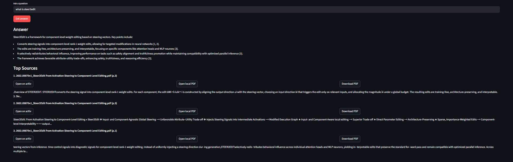

# AI Research Papers RAG

A single-turn RAG assistant over AI research papers (100-150 papers scale), built for internship/demo use.

## Demo



## What This Project Shows

- End-to-end RAG pipeline over real research PDFs.
- Grounded answers with source snippets and paper links.
- Local paper actions from UI: open local PDF and download PDF.
- Reproducible data/index pipeline for interviewers.

## Features

- `arXiv downloader`: fetches recent AI papers into `data/papers/`.
- `ingestion/indexing`: PDF parsing, chunking, embedding, and local vector index.
- `retrieval + generation`: cosine similarity retrieval + constrained answer generation.
- `single-turn UI`: one question box, no chat history, top source chunks with links.

## Tech Stack

- Python 3.14
- Streamlit
- OpenRouter (LLM + embeddings API via OpenAI-compatible client)
- NumPy + local JSONL/NPY index
- arXiv + pypdf

## Project Structure

```text
RAG project/
  app.py
  requirements.txt
  .env.example
  data/
    papers/            # local PDFs (not committed)
    index/             # local index files (not committed)
  docs/
    screenshots/
      latest-demo.png
  src/
    config.py
    download_arxiv.py
    ingest.py
    rag_chain.py
```

## Setup

```powershell
python -m venv .venv
.\.venv\Scripts\Activate.ps1
pip install -r requirements.txt
Copy-Item .env.example .env
```

Edit `.env` and set:

```env
OPENROUTER_API_KEY=your_openrouter_key_here
```

## Build Dataset + Index

Download papers:

```powershell
python -m src.download_arxiv --max-results 120
```

Use bundled tiny sample dataset (fastest way to test from GitHub):

```powershell
python -m src.use_sample_dataset --clean
python -m src.ingest --reset --max-papers 3
```

Build index:

```powershell
python -m src.ingest --reset
```

Quick smoke test (smaller index):

```powershell
python -m src.ingest --reset --max-papers 20
```

## Run App

```powershell
streamlit run app.py
```

If port `8501` is busy:

```powershell
streamlit run app.py --server.port 8502
```

## How to Run (End-to-End)

1. Create and activate environment.
2. Install dependencies.
3. Add OpenRouter key in `.env`.
4. Download papers.
5. Build index.
6. Start Streamlit.

```powershell
python -m venv .venv
.\.venv\Scripts\Activate.ps1
pip install -r requirements.txt
Copy-Item .env.example .env
# set OPENROUTER_API_KEY in .env
python -m src.download_arxiv --max-results 120
python -m src.ingest --reset
streamlit run app.py --server.port 8502
```

Notes:
- `data/papers/` and `data/index/` are generated locally and intentionally not committed.
- `.env` is excluded from git; use `.env.example`.
- Tiny sample files are included in `data/sample_papers/` for quick evaluation.
